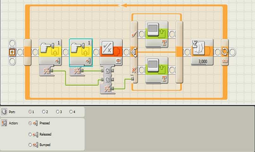

# Planejamento
- Introdução
- Logo
- Lego
     - Módulo de controle
     - Seguidor de trajetória
     - Bluetooth

---
# Introdução

- De acordo com Piaget, as pessoas constroem
conhecimento na medida em que agem sobre o
objeto de conhecimento (uma coisa, uma idéia
ou uma pessoa) e sofrem uma ação deste
objeto.

---
# Introdução

- Baseados no texto do livro Mindstorms: Children,
Computers, and Powerful Ideas o
M.I.T. Media Labs iniciou a comercialização do Lego Mindstorms.

---
# Logo
- O logo é um programa para se desenvolver o raciocínio lógico, sendo similar à programação.
- Os comandos básicos são:
    - pf X - Anda x unidades de espaço para frente
    - pt X - Anda x unidades de espaço para trás.
    - pd X - Vira x graus para a direita.
    - pe X - Vira x graus para a esquerda.
---
# Lego Mindstorms NXT 2.0 Programming Software
- É um programa para a programação de controladores NXT.
- Ele segue um estilo de fluxo, em que o programa é executando da esquerda para a direita.
- Para representar as ações são usados blocos.

---
# Lego Mindstorms NXT 2.0 Programming Software

---
# Exemplo de Programa

- Como um exemplo de programa feito no Lego Mindstorms NXT 2.0 Programming Software será usado um programa que verifica de 3 em 3 segundos, se os sensores de toque nas portas 1 e 2 foram pressionados, e mostra verdadeiro caso tenham sido ou falso caso contrário.

---
# Exemplo de Programa

- O primeiro bloco indica que deve ser verificado se o sensor de toque na porta um foi ativado.
---
# Exemplo de Programa

- O segundo bloco indica que deve ser verificado se o sensor de toque na porta dois foi ativado.
---
# Exemplo de Programa

- O terceiro bloco indica uma função lógica, que recebe como parâmetros "A" e "B", que estão ligados nas saídas lógicas dos blocos de sensores, e retorna em uma saída lógica o resultado da operação que é, nesse caso, uma OR.
---
# Exemplo de Programa

- O quarto bloco indica um "avaliador de condições", que executa os blocos na parte de cima, caso a condição ligada à sua entrada seja verdadeira, e executa os blocos da parte de baixo caso a condição ligada à sua entrada seja falsa.
---
# Exemplo de Programa

- O quinto bloco indica que deve ser escrito na tela do controlador "Verdadeiro", e só é executado caso algum sensor tenha sido pressionado.
---
# Exemplo de Programa

- O sexto bloco indica que deve ser escrito na tela do controlador "Falso", e só é executado caso nenhum sensor tenha sido pressionado.
---
# Exemplo de Programa

- O sétimo bloco indica que o controlador deve esperar três segundos antes de continuar a execução do programa.
---
# Exemplo de Programa

- E o último bloco indica um laço de repetição infinito, o que faz com que o programa seja executado novamente.
