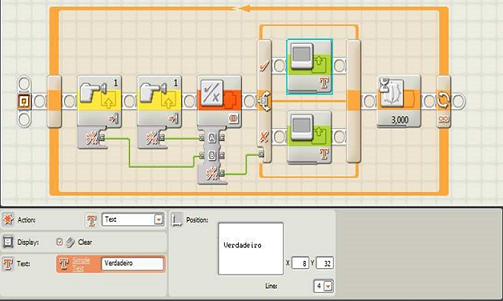
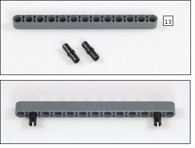
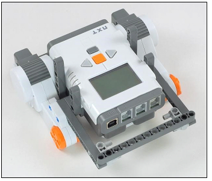
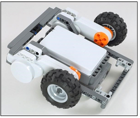
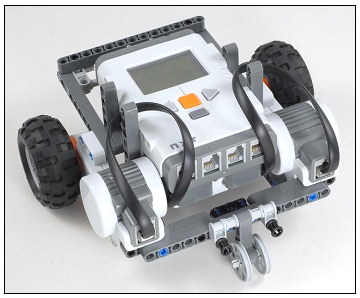

# Planejamento
- Introdução
- Logo
- Lego
     - Express-Bot
     - Sumô
     - Bluetooth
     - Futebol de Robôs

---
# Introdução

- De acordo com Piaget, as pessoas constroem
conhecimento na medida em que agem sobre o
objeto de conhecimento (uma coisa, uma idéia
ou uma pessoa) e sofrem uma ação deste
objeto.

---
# Introdução

- Baseados no texto do livro Mindstorms: Children,
Computers, and Powerful Ideas o
M.I.T. Media Labs iniciou a comercialização do Lego Mindstorms.

---
# Logo
- O logo é um programa para se desenvolver o raciocínio lógico, sendo similar à programação.
- Os comandos básicos são:
    - pf X - Anda x unidades de espaço para frente
    - pt X - Anda x unidades de espaço para trás.
    - pd X - Vira x graus para a direita.
    - pe X - Vira x graus para a esquerda.
---
# Lego Mindstorms NXT 2.0 Programming Software
- É um programa para a programação de controladores NXT.
- Ele segue um estilo de fluxo, em que o programa é executando da esquerda para a direita.
- Para representar as ações são usados blocos.

---
# Lego Mindstorms NXT 2.0 Programming Software

---
# Exemplo de Programa

- Como um exemplo de programa feito no Lego Mindstorms NXT 2.0 Programming Software será usado um programa que verifica de 3 em 3 segundos, se os sensores de toque nas portas 1 e 2 foram pressionados, e mostra verdadeiro caso tenham sido ou falso caso contrário.

---
## Exemplo de Programa

- O primeiro bloco indica que deve ser verificado se o sensor de toque na porta um foi ativado.
---
## Exemplo de Programa

- O segundo bloco indica que deve ser verificado se o sensor de toque na porta dois foi ativado.
---
## Exemplo de Programa

- O terceiro bloco indica uma função lógica, que recebe como parâmetros "A" e "B", que estão ligados nas saídas lógicas dos blocos de sensores, e retorna em uma saída lógica o resultado da operação que é, nesse caso, uma OR.
---
## Exemplo de Programa

- O quarto bloco indica um "avaliador de condições", que executa os blocos na parte de cima, caso a condição ligada à sua entrada seja verdadeira, e executa os blocos da parte de baixo caso a condição ligada à sua entrada seja falsa.
---
## Exemplo de Programa

- O quinto bloco indica que deve ser escrito na tela do controlador "Verdadeiro", e só é executado caso algum sensor tenha sido pressionado.
---
## Exemplo de Programa

- O sexto bloco indica que deve ser escrito na tela do controlador "Falso", e só é executado caso nenhum sensor tenha sido pressionado.
---
## Exemplo de Programa

- O sétimo bloco indica que o controlador deve esperar três segundos antes de continuar a execução do programa.
---
## Exemplo de Programa

- E o último bloco indica um laço de repetição infinito, o que faz com que o programa seja executado novamente.
---
# Montando um Robô
- Agora para realmente iniciarmos a parte prática, vamos montar um robô básico. O robô escolhido foi o "Express-Bot".
---
## Lado Esquerdo

---
## Lado Esquerdo

---
## Lado Esquerdo

---
## Lado Esquerdo

---
## Lado Esquerdo

---
## Lado Direito

---
## Lado Direito

---
## Lado Direito

---
## Lado Direito

---
## Lado Direito

---
## Traseira

---
## Traseira

---
## Traseira

---
## Traseira

---
## Frente

---
## Frente

---
## Rodas

---
## Rodas

---
## Rodas

---
## Rodas

---
## Cabos

---
## Cabos

---
## Cabos

---
## Cabos

---
## Roda Boba

---
## Roda Boba

---
## Roda Boba

---
## Roda Boba

---
## Roda Boba

---

# Programando o Express-Bot
- Agora vamos iniciar a programação do robô, fazendo um programa em que o robô se move e reproduz sons.
---
## Programa de Exemplo

- Digite um nome para o programa.
---
## Programa de Exemplo

- Insira um motor (Move) e ajuste a potencia (Power) para 50 e a duração para 3
segundos.
---
## Programa de Exemplo

- Entre com o objeto de temporização.
---
## Programa de Exemplo

- Ajuste o tempo para 2 segundos.
---
## Programa de Exemplo

- Insira outro bloco de movimento e modifique-o para girar para a esquerda. Modi
fique a potencia para 50 e mantenha o tempo em 1 segundo. 
---
## Programa de Exemplo

- Entre com outro bloco temporizador e ajuste para 3 segundos.
---
## Programa de Exemplo

- Adicione um bloco de som e selecione a opção Tone.
---
## Programa de Exemplo

- Insira um laço (Loop) de repetição no programa. 
---
## Programa de Exemplo

- Coloque o bloco no início do programa.
---
## Programa de Exemplo

- Arraste o mouse em diagonal e selecione todos os comandos posteriores ao laço.
---
## Programa de Exemplo

- Insira os comandos dentro do laço.
---
## Programa de Exemplo

- Ajuste o critério de interrupção do laço a partir do sensor. 
---
## Programa de Exemplo

- Selecione o sensor ultrassônico.
---
## Programa de Exemplo

- Ajuste a distância do sensor para 10 polegadas (inches).
---
## Programa de Exemplo

- Entre com um bloco de áudio para finalizar o programa quando o sensor ultrassônico for ativado.
---
## Programa de Exemplo

- Ligue o cabo USB e faça o download do programa para o robô. Depois pressione
o botão laranja do robô até que o que o programa entre em execução. 
---
# Sumô
- Agora, vamos construir robôs de sumô para lutarem!
- Mas antes vamos ver as regras do sumô de robôs.
---
## Regras
- Uma partida consistirá em 3 (três) rounds, cada round
terá um tempo nominal de 1 (um) minuto, podendo
ser acrescentado, a critério do juiz, 30 segundos. 
- A equipe que ganhar dois rounds ou receber dois
pontos de Yukô primeiro, será declarada vencedora. 
- Uma equipe recebe um ponto
de Yukô quando vence um round. 
- Caso o tempo limite seja atingido antes de uma equipe atingir dois pontos de Yukô e uma das equipes tenha recebido
um ponto de Yukô, enquanto a outra não tiver
ganhado pontos, esta será a vencedora.
- Um ponto de Yukô será concedido quando:
    - Um robô legalmente forçar o corpo do robô oponente a tocar o espaço fora do Dojô (ringue).
    - Quando o robô adversário tocar o espaço externo
ao Dojô por si mesmo.
