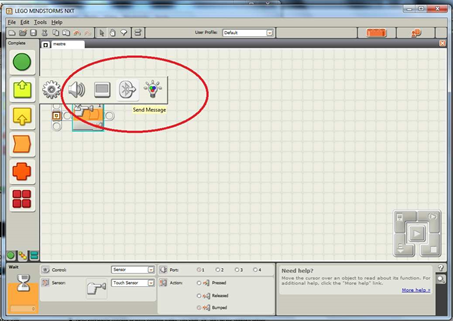

# Planejamento
- Introdução
- Logo
- Lego
     - Express-Bot
     - Sumô
     - Bluetooth
     - Futebol de Robôs

---
# Bluetooth

- O Bluetooth é uma forma de comunicação entre dois NXT's.
- Funciona no esquema de mestre-escravo, sendo possível um mestre ter até três escravos.

---
# Exemplo de Programa

- Para exemplificar o bluetooth, será feito um programa simples, em que um número é enviado e o escravo se move para frente quando recebe esse número.

---
## Exemplo de Programa

- Entre com um nome para o programa.
---
## Exemplo de Programa - Mestre

- Insira um temporizador.
---
## Exemplo de Programa - Mestre

- Mantenha o Touch Sensor como sensor, a porta como 1 e a opção Bumped para o acionamento após a batida no sensor.
---
## Exemplo de Programa - Mestre

- Entre com o bloco de envio de mensagens do Bluetooth.
---
## Exemplo de Programa - Mestre

- Selecione a opção numérica e envie o número 38 para o tipo e valor da mensagem.
---
## Exemplo de Programa - Mestre

- Fac¸a o download do programa para o NXT mestre.
---
## Exemplo de Programa - Escravo

- Clique na aba superior para voltar na tela de abertura e crie um novo programa.
---
## Exemplo de Programa - Escravo

- Entre com um novo temporizador.
---
## Exemplo de Programa - Escravo

- Selecione o temporizador para ser acionado com a recepção de uma mensagem.
---
## Exemplo de Programa - Escravo

- Configure o receptor para o tipo numerico e o valor a ser comparado como 38.
---
## Exemplo de Programa - Escravo

- Entre com um bloco motor.
---
## Exemplo de Programa - Escravo

- Configure a potência do motor para 50% e 2 rotações.
---
## Exemplo de Programa - Escravo

- Faça o download do programa no NXT escravo.
